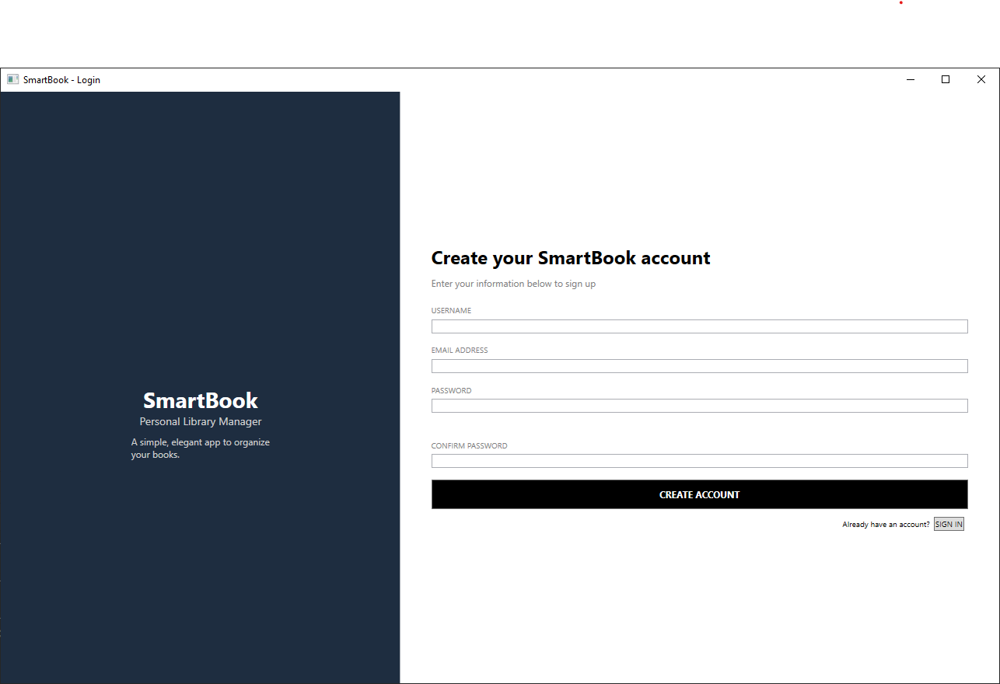

SmartBook
=========
A WPF-based digital library management system with built-in Gemini AI recommendations, developed in C# using .NET 8, Entity Framework Core, and modern CI/CD and testing pipelines.

## Table of Contents
- [Overview](#overview)
- [Features](#features)
- [User Roles](#user-roles)
- [Screenshots](#screenshots)
- [Requirements](#requirements)
- [Building and Running](#building-and-running)
- [CI/CD Pipeline](#cicd-pipeline)
- [Technical Overview](#technical-overview)
- [Challenges & Solutions](#challenges--solutions)

## Overview
SmartBook is a desktop application for Windows that enables users to manage a personal or small-scale digital library. Featuring intuitive CRUD operations, rich statistics, collaboration features, and intelligent book recommendations powered by Gemini AI, SmartBook supports both everyday users and administrator workflows.

## Features

### Core
* **Book Management:** Add, edit, delete, rate, and filter books by title, author, or category.
* **Author & Category Management:** Manage author bios and book categories, with support for edit requests and history.
* **User Profiles:** Secure authentication, user role assignment, password reset, and email notifications.

### Advanced Features
* **AI-Powered Recommendations:** Personalized book suggestions based on user activity, tags, and reading history. Gemini AI is used for recommendation logic, asynchronously called to keep the UI responsive.
* **Edit Requests Workflow:** Users can propose edits to author and category entries; admins review and approve requests.
* **Statistics Dashboard (Admin):** Admins can view statistics about books, categories, users, and usage activity.

### Platform Features
* **WPF Desktop Application:** Modern MVVM architecture and responsive XAML UI.
* **.NET 8 & Entity Framework Core:** Relational data access with SQL Server and In-Memory providers.
* **Automated CI/CD:** Full GitHub Actions pipeline (build, test, publish) for reliability and rapid iteration.
* **Testing:** Automated unit tests with xUnit; CI integration for quality assurance.

## User Roles

### User
* Browse and search for books.
* Track read/unread status and rate books.
* Propose edits to authors and categories.

### Admin
* All user privileges, plus:
* View library statistics (books, categories, users, activity).
* Manage (add/edit/delete) books, categories, and authors directly.
* Review and process pending edit requests.

## Screenshots




## Requirements
* Windows with .NET 8 SDK
* MS SQL Server

## Building and Running

```bash
git clone https://github.com/QingTian1927/SmartBook.git
cd SmartBook
# Build the project
dotnet build
# Run the WPF application
dotnet run --project SmartBook.csproj
```

Or download the published release from the [GitHub Releases](https://github.com/QingTian1927/SmartBook/releases) page.

## CI/CD Pipeline
* Automated builds and tests are run on each push and pull request via GitHub Actions.
* Self-contained Windows binaries are published as pipeline artifacts for easy deployment.
* See the workflow file: [ci.yml](.github/workflows/ci.yml)

## Technical Overview
* **OOP Principles:** Clean design with encapsulation (entity properties), abstraction (service interfaces), inheritance (partial classes), and polymorphism (shared edit request logic).
* **Dependency Injection:** EF Core’s DbContext is managed with a scoped lifetime to avoid threading issues in async and multithreaded scenarios.
* **Multithreading:** Background tasks (such as AI calls) keep the UI responsive.

## Challenges & Solutions
* **CI Failures & Deprecated Actions:** Updated to the latest GitHub Actions for stable automation.
* **Test/Build Pipeline Issues:** Aligned build/test configurations and runtime identifiers.
* **Assembly Attribute Duplication:** Rationalized assembly info to avoid MSBuild errors.
* **Thread Safety:** Scoped DbContext via dependency injection to prevent concurrency bugs.
